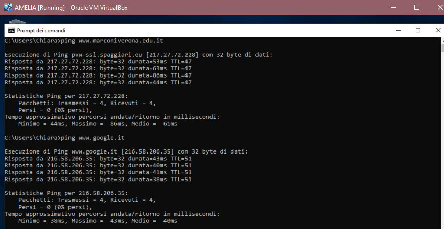
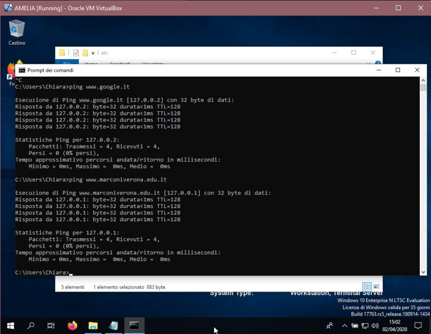

# Hosts DNS v01.02

## Tags
 #sri, #os, #hosts, #DNS, #IP

## Description
### NAT 

The DNS address is 192.168.1.1

### Bridge

The DNS address is 192.168.1.1

## Ping before hosts changes

## Hosts changes

We changed the mapping of IP address, we put different hosts names.

## Ping after hosts changes

## Ping changes
|          WebSite         |     Before    |   After   |
|           :---:          |      :---:    |   :---:   |
| www.marconiverona.edu.it | 217.27.72.228 | 127.0.0.1 |
|        www.google.it     | 216.58.206.35 | 127.0.0.2 |

---

By Davide Castellani 3CI a.s. 2019/2020 
   Sabaini Chiara 3CI a.s. 2019/2020 (only version 01.01)

---

If you have any problem please contact me:
- davidecastellani@castellanidavide.it
- chiara@sabaini.com (only version 01.01)